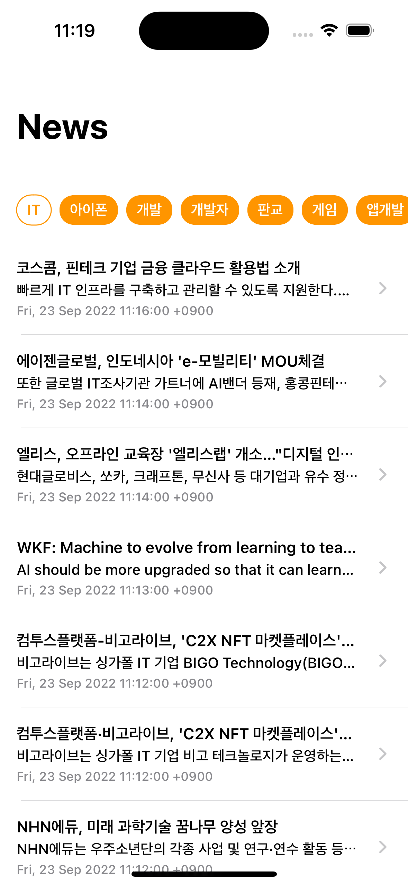

# KeywordNews

Naver 검색 API를 사용하여 뉴스를 검색해 볼수 있는 샘플앱입니다.

TagCollectionView의 키워드를 선택하면 관련 뉴스리스트를 보여주고 셀 클릭시 웹뷰를 보여줍니다. 

MVP 패턴으로 작성하였습니다. 

사용한 라이브러리
- [Sanpkit](https://github.com/SnapKit/SnapKit)
- [TTGTagCollectionView](https://github.com/zekunyan/TTGTagCollectionView)
- [Alamofire](https://github.com/Alamofire/Alamofire)
